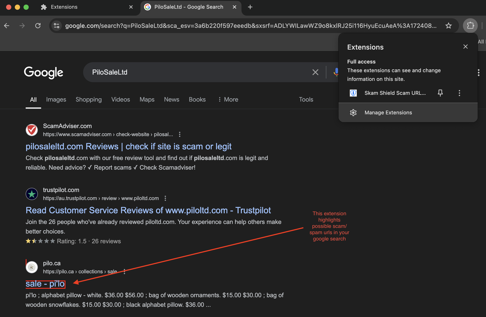

# Skam Shiled Scam URL Checker Browser Extension

## Overview

The **Scam URL Checker** Browser extension helps users identify potentially dangerous URLs in Google search results. It automatically initializes Firebase, checks each link in the search results against a Firestore database, and highlights links flagged as suspicious or malicious.



## Features

- **Automatic Firebase Initialization**: Initializes Firebase when the extension is enabled.
- **Periodic URL Checking**: Checks search result links every 5 seconds for potential scams.
- **Visual Alerts**: Highlights flagged URLs with a border and tooltip to warn users.

## Installation

1. **Clone the Repository**:

   ```bash
   git clone https://github.com/c2siorg/SkamSheild.git
   cd ss-browser-ext
   ```

2. **Load the Extension in Chrome**:
   1. Open Chrome and navigate to `chrome://extensions/`.
   2. Enable "Developer mode" using the toggle in the top-right corner.
   3. Click "Load unpacked" and select the extension directory.

## How It Works

1. **Firebase Initialization**:

   - On page load, the extension initializes Firebase using a sandboxed iframe.
   - Firebase configuration details are loaded from `sandbox.js`.

2. **URL Checking**:

   - The extension runs a content script (`content.js`) on Google search results pages.
   - It sends each link's URL to the Firebase sandbox for checking.
   - Flags and highlights URLs that are found in the Firestore database as suspicious or malicious.

3. **Alerts**:
   - Suspicious links are highlighted with a red border and a tooltip indicating potential danger.

## File Structure

- **manifest.json**: Defines the extension's settings, permissions, and content scripts.
- **content.js**: Injected into Google search results pages to handle URL checking and interaction with the sandbox.
- **sandbox.html**: Contains the sandboxed iframe for Firebase operations.
- **sandbox.js**: Handles Firebase initialization and URL checking in the sandbox.
- **popup.html**: (Optional) Provides a simple interface for additional actions or debugging.
- **popup.js**: (Optional) Handles interactions with the popup, if used.

## Configuration

1. **Firebase Setup**:

   - Replace the placeholders in `sandbox.js` with your actual Firebase project configuration:
     ```javascript
     const config = {
       projectId: "YOUR_PROJECT_ID",
       apiKey: "YOUR_API_KEY",
       storageBucket: "YOUR_STORAGE_BUCKET",
     };
     ```

2. **Firestore Collection**:
   - Ensure your Firestore database has a collection named `scamURLs` where URLs to be flagged are stored.

## Development

- **Testing**: Use Chrome's Developer Tools to inspect the extension's behavior and debug any issues.
- **Updating**: Make changes to the content and sandbox scripts as needed, and reload the extension from `chrome://extensions/`.

## Contributing

Feel free to open issues or submit pull requests to improve the extension. Contributions are welcome!

## License

This project is licensed under the MIT License. See the [LICENSE](LICENSE) file for details.
