# Skam Shield Mobile Client

## Introduction

The Skam Shield Mobile Client Project is a React Native application designed to provide real-time assistance and security features. It includes user authentication, malicious content detection, and interaction with Firebase services.

## Features

- **User Authentication**: Sign in and sign up with email or Google.
- **Malicious Content Detection**: Report and view suspicious content.
- **Local Firebase Emulators**: Connect to local emulators for development.

## Screenshots

### 1. Splash Screen

<table>
<tr>
    <td>
        <figure>
            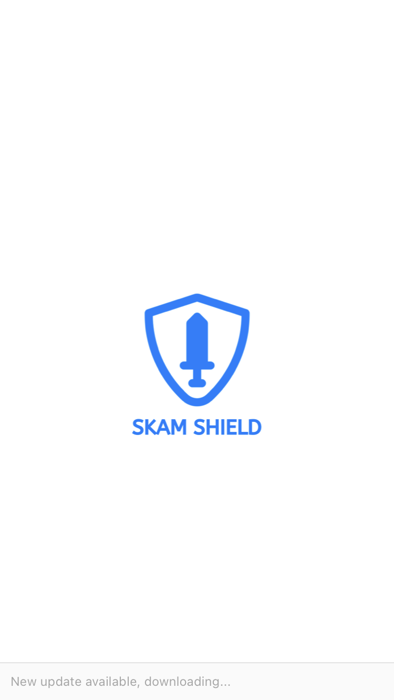
            <figcaption>iOS Splash Screen</figcaption>
        </figure>
    </td>
    <td>
        <figure>
            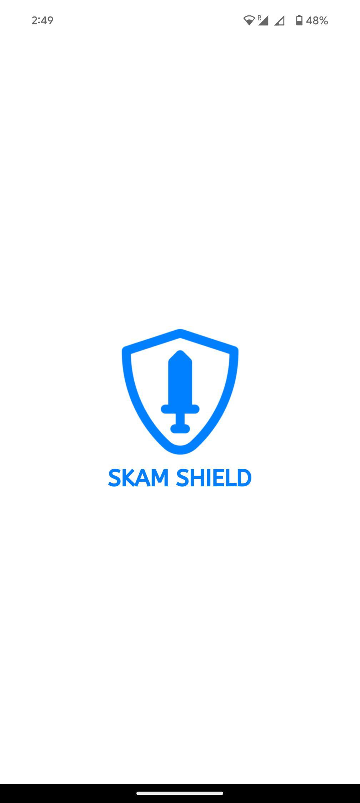
            <figcaption>Android Splash Screen</figcaption>
        </figure>
    </td>
</tr>
</table>

### 2. Search UI

<table>
<tr>
    <td>
        <figure>
            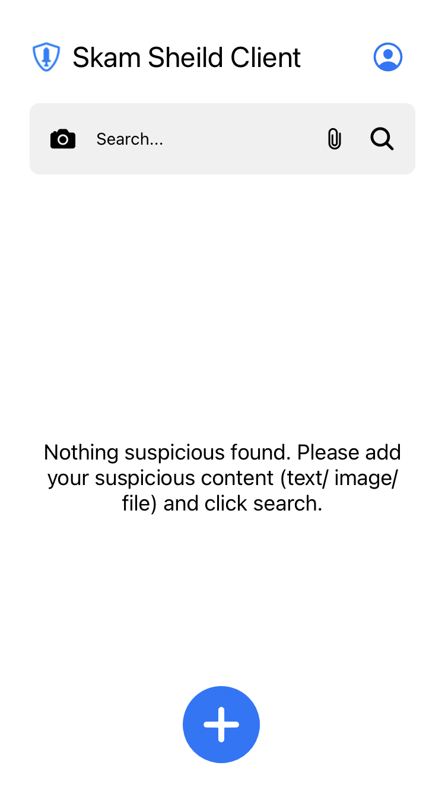
            <figcaption>iOS Search UI</figcaption>
        </figure>
    </td>
    <td>
        <figure>
            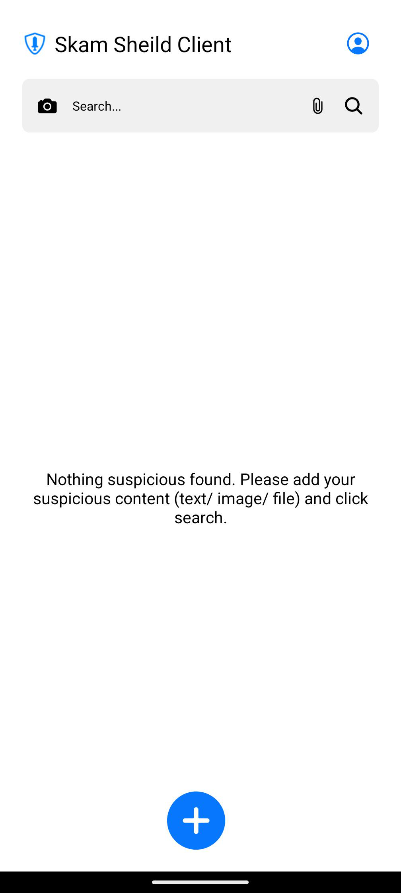
            <figcaption>Android Search UI</figcaption>
        </figure>
    </td>
</tr>
</table>

### 3. Malicious Content View

<table>
<tr>
    <td>
        <figure>
            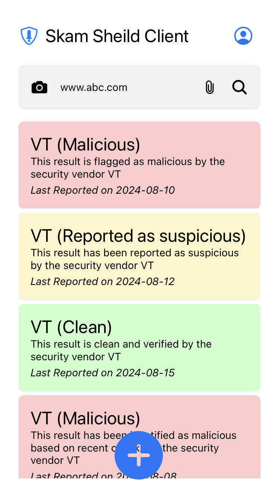
            <figcaption>iOS Malicious Content View</figcaption>
        </figure>
    </td>
    <td>
        <figure>
            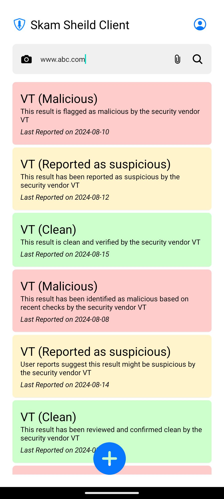
            <figcaption>Android Malicious Content View</figcaption>
        </figure>
    </td>
</tr>
</table>

### 4. Malicious Content Upload

<table>
<tr>
    <td>
        <figure>
            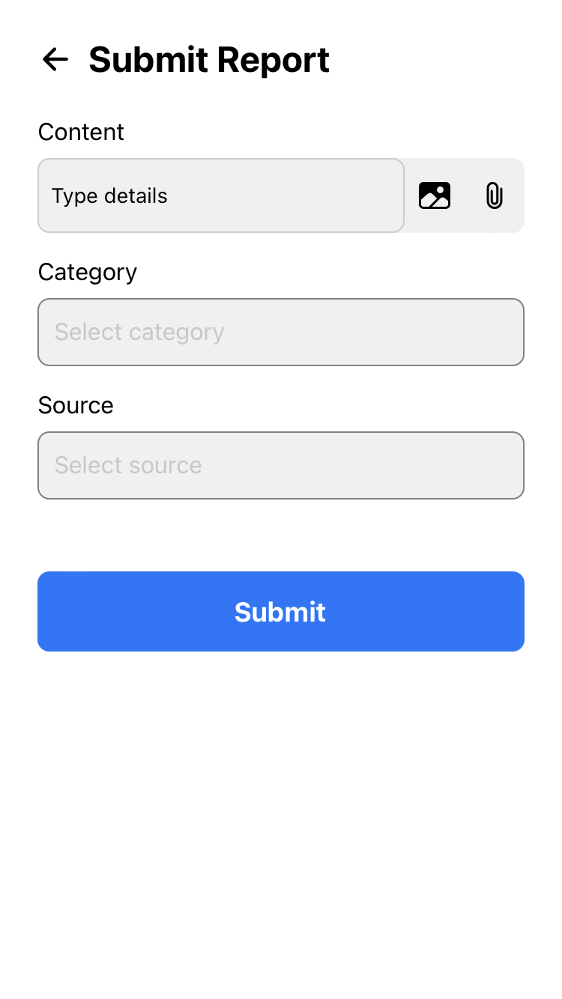
            <figcaption>iOS Malicious Content Upload - Step 1</figcaption>
        </figure>
    </td>
    <td>
        <figure>
            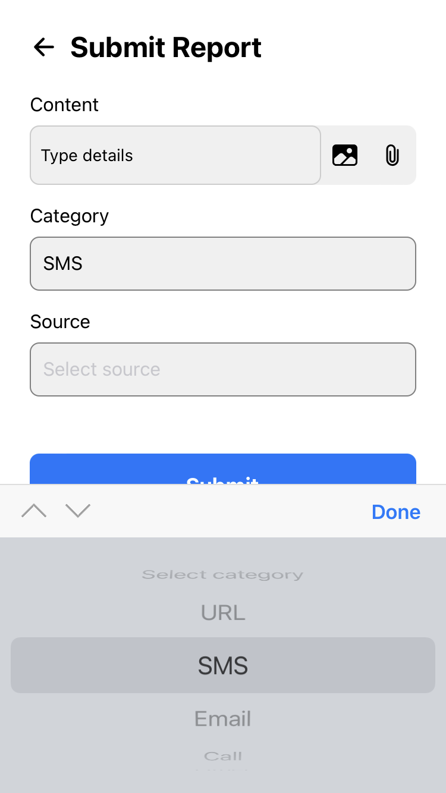
            <figcaption>iOS Malicious Content Upload - Step 2</figcaption>
        </figure>
    </td>
    <td>
        <figure>
            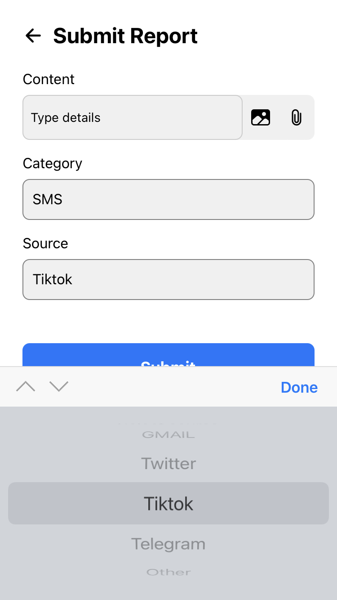
            <figcaption>iOS Malicious Content Upload - Step 3</figcaption>
        </figure>
    </td>
</tr>
<tr>
    <td>
        <figure>
            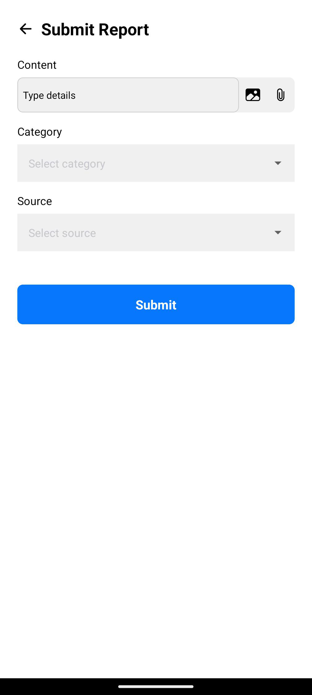
            <figcaption>Android Malicious Content Upload - Step 1</figcaption>
        </figure>
    </td>
    <td>
        <figure>
            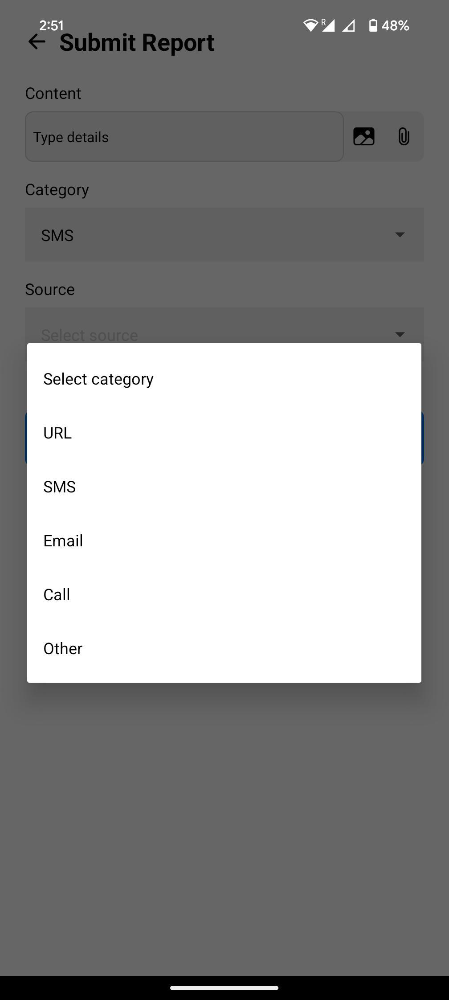
            <figcaption>Android Malicious Content Upload - Step 2</figcaption>
        </figure>
    </td>
    <td>
        <figure>
            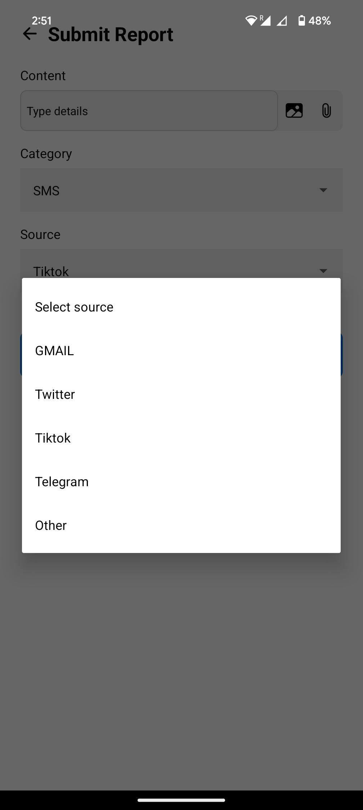
            <figcaption>Android Malicious Content Upload - Step 3</figcaption>
        </figure>
    </td>
</tr>
</table>

### 5. AI Assistance Bot

<table>
<tr>
    <td>
        <figure>
            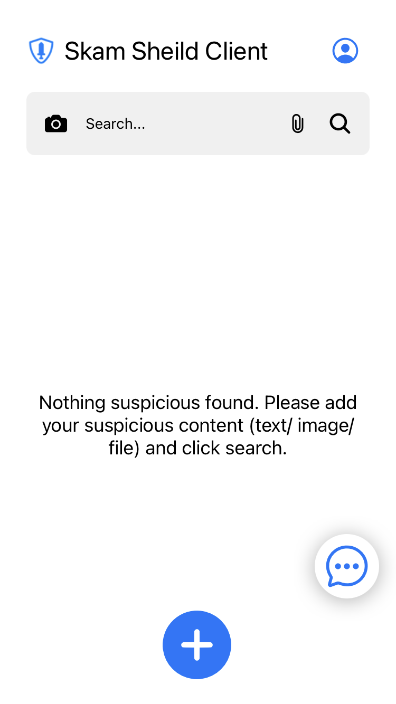
            <figcaption>iOS AI Assistance Bot - Step 1</figcaption>
        </figure>
    </td>
    <td>
        <figure>
            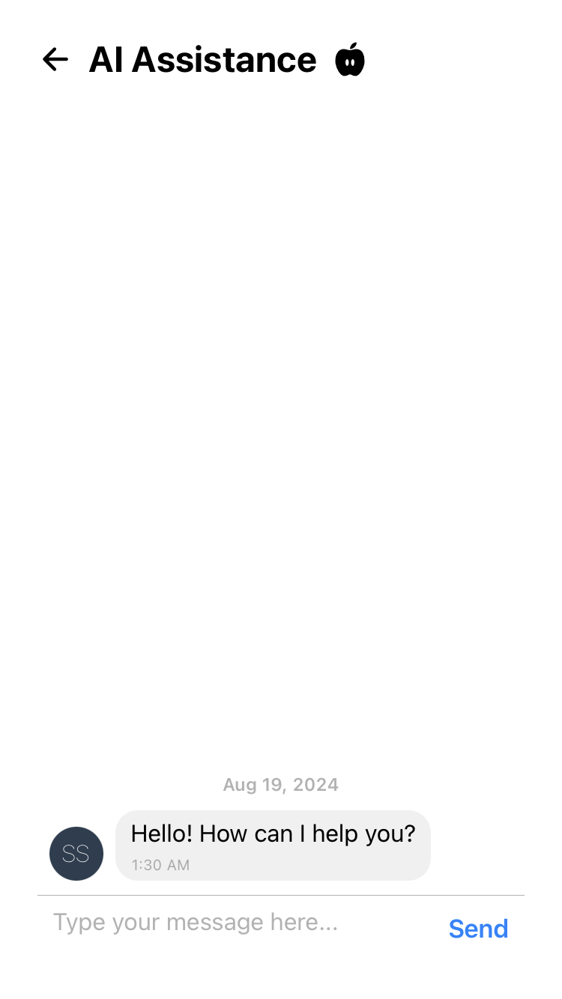
            <figcaption>iOS AI Assistance Bot - Step 2</figcaption>
        </figure>
    </td>
    <td>
        <figure>
            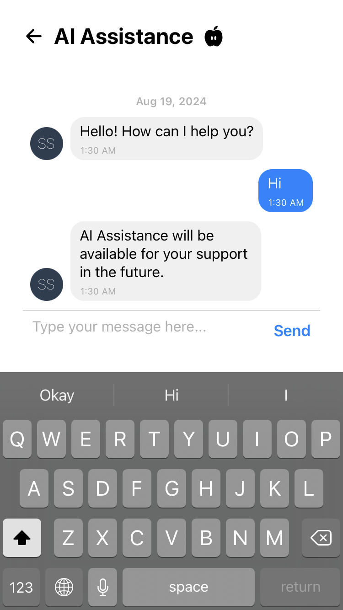
            <figcaption>iOS AI Assistance Bot - Step 3</figcaption>
        </figure>
    </td>
</tr>
<tr>
    <td>
        <figure>
            
            <figcaption>Android AI Assistance Bot - Step 1</figcaption>
        </figure>
    </td>
    <td>
        <figure>
            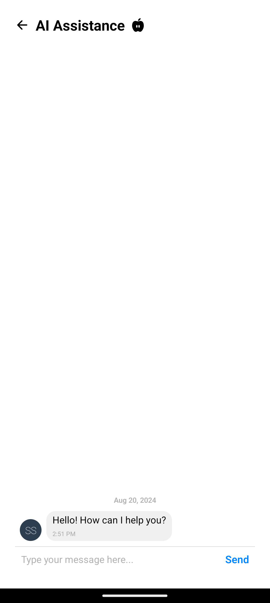
            <figcaption>Android AI Assistance Bot - Step 2</figcaption>
        </figure>
    </td>
    <td>
        <figure>
            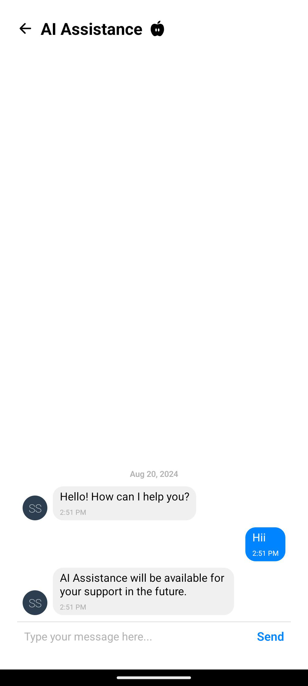
            <figcaption>Android AI Assistance Bot - Step 3</figcaption>
        </figure>
    </td>
</tr>
</table>

## DEMO

<figure>
    
    <figcaption>Demo of Malicious Content Upload</figcaption>
</figure>

## Setup

### Prerequisites

1. **Node.js**: Ensure you have Node.js installed. [Download Node.js](https://nodejs.org/)
2. **Expo CLI**: Install Expo CLI globally if you haven't already:
   ```bash
   npm install -g expo-cli
   ```
3. **Firebase**: Set up a Firebase project and configure Firebase in your application.

### Installation

1. **Clone the Repository**:

   ```bash
   git clone https://github.com/c2siorg/SkamSheild.git
   cd ss-mobile-client
   ```

2. **Install Dependencies**:

   ```bash
   npm install
   ```

3. **Configure Firebase**:

   - Create a `firebaseConfig.js` file in the `configurations` folder.
   - Add your Firebase configuration details to this file.

4. **Set Up Firebase Emulators** (Optional, for local development):
   Ensure you have Firebase CLI installed and set up emulators:

   ```bash
   npm install -g firebase-tools
   firebase init emulators
   ```

5. **Connect to Local Emulators**:
   Add the following code to your Firebase setup file to connect to local emulators:

   ```javascript
   import { connectAuthEmulator } from "firebase/auth";
   import { connectFirestoreEmulator } from "firebase/firestore";
   import { connectFunctionsEmulator } from "firebase/functions";
   import { connectStorageEmulator } from "firebase/storage";

   if (__DEV__) {
     console.log(
       "Running in development mode -- connecting to local Firebase emulators"
     );
     connectAuthEmulator(auth, "http://localhost:9098");
     connectFirestoreEmulator(firestore, "localhost", 8082);
     connectFunctionsEmulator(functions, "localhost", 5003);
     connectStorageEmulator(storage, "localhost", 9199);
   }
   ```

6. **Run the App**:
   Start the development server:

   ```bash
   npm start
   ```

   This will open the Expo developer tools in your browser. Follow the instructions to run the app on an emulator or physical device.

## Usage

- **Sign In / Sign Up**: Use the provided forms to authenticate users.
- **Report Suspicious Content**: Use the UI to report and view suspicious content.
- **Development Mode**: The app will connect to local Firebase emulators if running in development mode.

## Troubleshooting

- **Firebase Emulator Issues**: Ensure that the Firebase emulators are running and accessible at the specified ports.
- **Environment Variables**: Make sure that `__DEV__` is set correctly based on your development environment.

## Contributing

Feel free to contribute to the project by submitting issues or pull requests.

## License

This project is licensed under the [MIT License](LICENSE).
