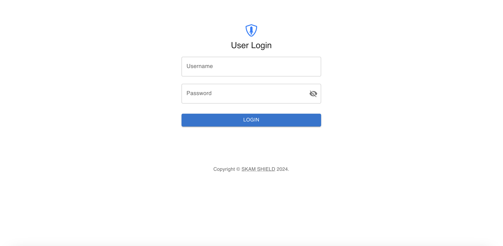

# Skam Shield Web Client

## Introduction

The Skam Shield Web Client is a React.js web application designed for administrators of the Skam Shield project. This application provides a user interface for reviewing and managing reports of suspicious content submitted through the Skam Shield mobile app. Admins can review reported content, update its status, and manage user reports.

## Features

- **Admin Access**: Restricted access for admins only.
- **Review Suspicious Content**: View and manage user-submitted reports.
- **Content Status Management**: Update the status of reported content.
- **Search and Filter**: Search and filter reported content for efficient review.

## Screenshots

### 1. Login


### 2. Dashboard


### 3. Report Review


### 4. Data Management


### 5. Reports Management


## Setup

### Prerequisites

- Node.js
- Firebase account and project

### Installation

1. Clone the repository:

   ```bash
   git clone https://github.com/c2siorg/SkamSheild.git
   ```

2. Navigate to the project directory:

   ```bash
   cd ss-web-client
   ```

3. Install dependencies:

   ```bash
   npm install
   ```

4. Configure Firebase:

   - Create a Firebase project at [Firebase Console](https://console.firebase.google.com/).
   - Update the `firebaseConfig` in the project with your Firebase project's configuration.

5. Start the project:

   ```bash
   npm start
   ```

   This will start the development server and open the application in your default web browser.

## Features

- **Login**: Admins can log in using their credentials.
- **Dashboard**: View an overview of reported content and their statuses.
- **Content Review**: Click on individual reports to review details and update their status.
- **Search and Filter**: Use the search bar and filters to find specific reports or narrow down the list.

## Usage

1. **Login**: Access the web client using your admin credentials.
2. **Dashboard**: Navigate to the dashboard to see an overview of the reported content.
3. **Review Reports**: Click on reports to review details and manage their status.
4. **Search and Filter**: Use search and filter options to efficiently manage reports.

## Contributing

Contributions are welcome! Please submit issues and pull requests. For major changes, open an issue first to discuss the proposed changes.

## License

This project is licensed under the MIT License - see the [LICENSE](LICENSE) file for details.
